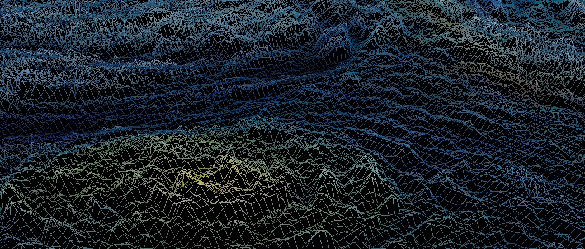
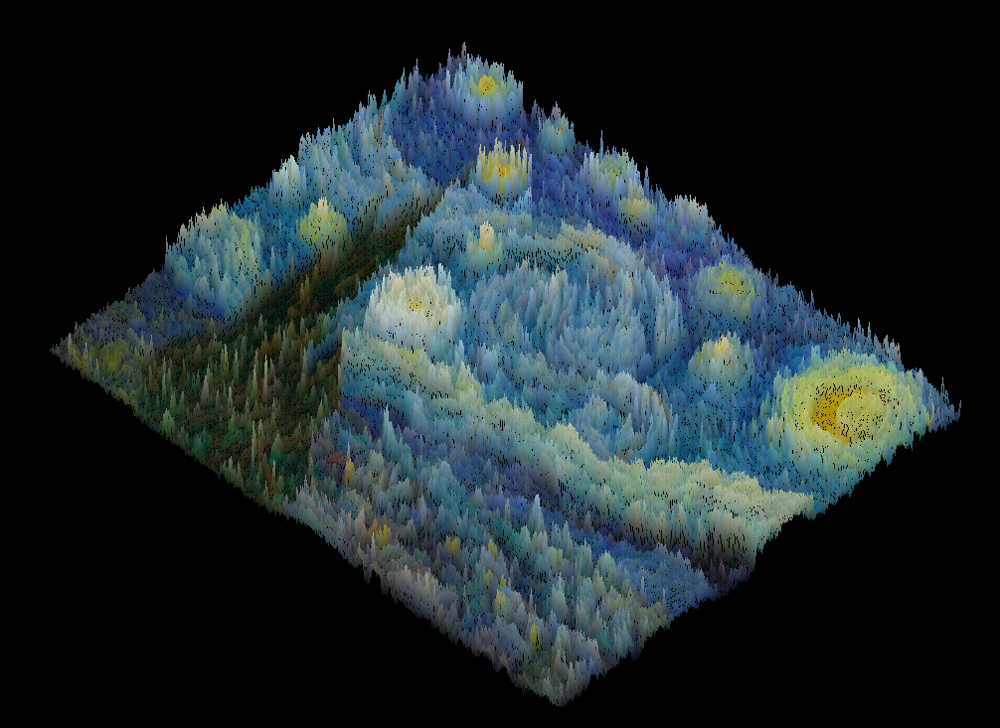
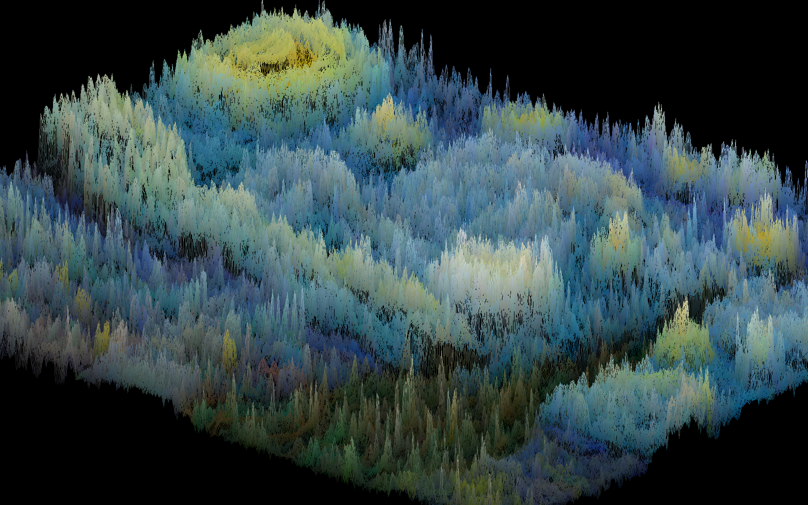
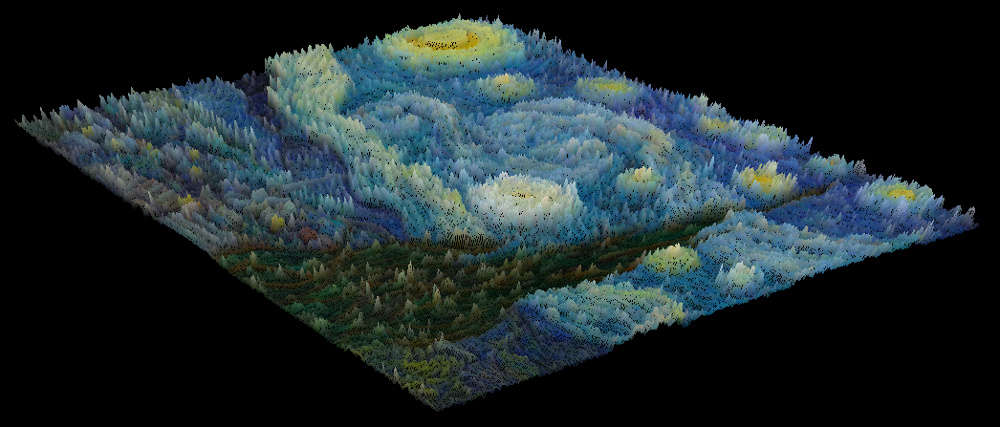
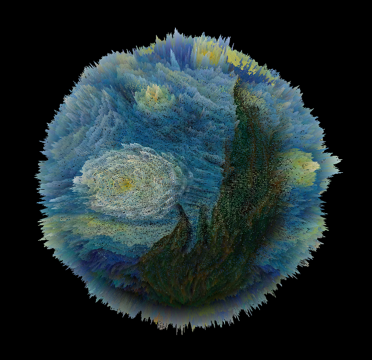
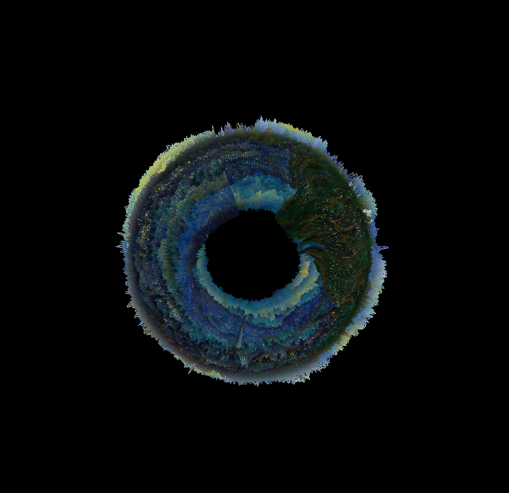
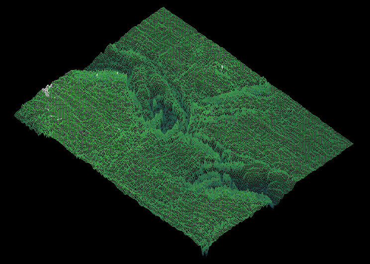
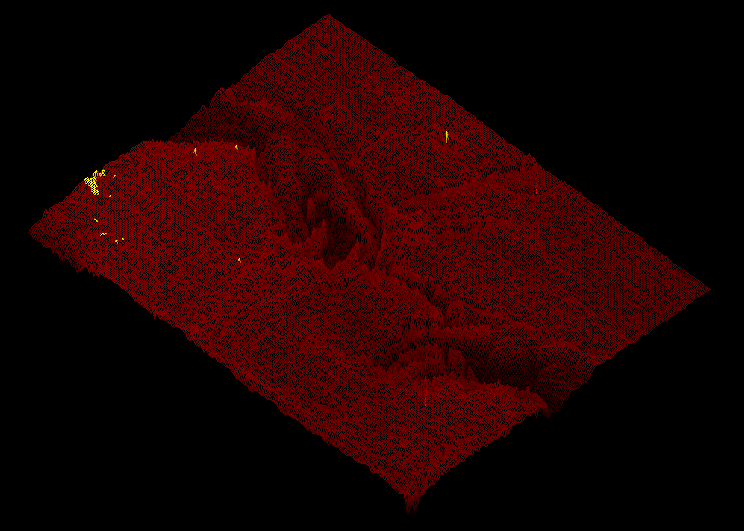
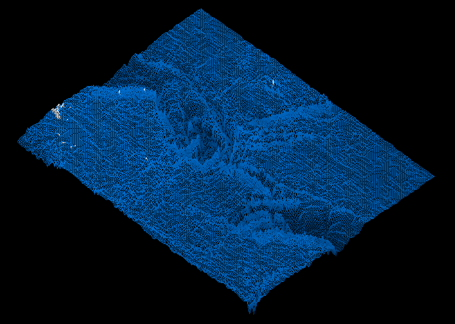
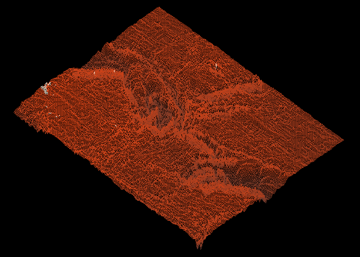

<div align="center">

# FDF — Fil de Fer

**Un moteur de rendu 3D temps réel écrit en C, propulsé par MiniLibX.**

Transforme n'importe quelle carte de hauteur en un monde filaire interactif :
projection isométrique ou perspective, transformations topologiques (tore, sphère),
dégradés de couleurs procéduraux et une caméra entièrement contrôlable à la souris.

[](https://en.wikipedia.org/wiki/C_(programming_language))
[](https://42lyon.fr)
[](https://github.com/42Paris/minilibx-linux)
[](#)
[](#)

<br>

<!-- 👉 REMPLACE cette image par ta plus belle vue (ex. persp_2.png) -->


</div>

---

## Sommaire

- [Aperçu](#aperçu)
- [Fonctionnalités](#fonctionnalités)
- [Contrôles](#contrôles)
- [Format des cartes](#format-des-cartes)
- [Compilation](#compilation)
- [Utilisation](#utilisation)
- [Architecture](#architecture)
- [Pipeline de rendu](#pipeline-de-rendu)
- [Palettes de couleurs](#palettes-de-couleurs)
- [Auteur](#auteur)

---

## Aperçu

> *« FDF »* (Fil De Fer) prend un fichier texte décrivant une grille de hauteurs
> et en dessine le maillage en perspective. Chaque point du maillage est relié à
> ses voisins par une ligne tracée avec l'algorithme de **Bresenham**, le tout
> interpolé avec un dégradé de couleur en fonction de l'altitude.

<table>
<tr>
<td align="center" width="33%">

**Isométrique** — projection classique du sujet


</td>
<td align="center" width="33%">

**Orthographique** — projection sans perspective


</td>
<td align="center" width="33%">

**Perspective** — caméra à focale réelle


</td>
</tr>
<tr>
<td align="center" width="50%">

**Sphère** — enroulement topologique


</td>
<td align="center" width="50%">

**Tore** — géométrie en anneau


</td>
</tr>
</table>

---

## Fonctionnalités

| Fonctionnalité | Détail |
|---|---|
| **Double projection** | Orthographique et perspective, commutables à chaud |
| **Caméra libre** | Rotation (yaw / pitch / roll), translation et zoom à la souris |
| **Transformations topologiques** | Maillage replié en **sphère** ou en **tore** |
| **Dégradés de couleurs** | Interpolation RGB sur l'altitude de chaque arête |
| **Presets de terrain** | Earth, Volcanic, Arctic, Martian |
| **Plans de clipping** | Near / far / z-near / z-far réglables |
| **HUD live** | Panneau d'informations affichant l'état de la scène en temps réel |
| **Bouton reset** | Réinitialisation caméra d'un clic |
| **Rendu par image** | Buffer d'image unique + double mise à l'échelle |

---

## Contrôles

### 🖱️ Souris

| Action | Effet |
|---|---|
| **Clic gauche + glisser** | Rotation de la caméra |
| **Clic droit + glisser** | Translation de la caméra |
| **Clic molette + glisser** | Translation sur l'axe Z *(projection non-isométrique)* |
| **Molette haut / bas** | Zoom avant / arrière |
| **Clic sur `reset`** | Réinitialise la position de la caméra |

### ⌨️ Clavier

| Touche | Effet |
|---|---|
| `Échap` | Quitter |
| `I` | Basculer mode isométrique ⟷ libre |
| `P` | Basculer orthographique ⟷ perspective *(mode libre)* |
| `T` | Changer la transformation : `none` → `torus` → `sphere` *(mode iso)* |
| `C` | Changer le preset de couleurs |
| `↑` / `↓` | Sélectionner le paramètre à modifier dans le HUD |
| `R` | Réinitialiser le paramètre sélectionné |
| `KP +` / `KP -` | Augmenter / diminuer le paramètre sélectionné |

### 🎛️ Paramètres modifiables (`↑`/`↓` + `KP +/-`)

```
0 → z_ratio         1 → near        2 → far
3 → z_near          4 → z_far       5 → mouse sensi
```

---

## Format des cartes

Une carte est un simple fichier `.fdf` : une grille de nombres où chaque valeur
représente l'**altitude** du point. Les couleurs optionnelles suivent la syntaxe
`z,0xRRGGBB`.

```text
0  0  0  0  0
0  1  1  1  0
0  1  2  1  0
0  1  1  1  0
0  0  0  0  0
```

Avec couleurs :

```text
0,0xFF0000   10,0x00FF00   0,0xFF0000
10,0x0000FF  20,0xFFFFFF   10,0x0000FF
0,0xFF0000   10,0x00FF00   0,0xFF0000
```

> Le dépôt fournit un large éventail de cartes de test dans `maps/` :
> montagnes, planisphères, portraits, fractales, etc.

---

## Compilation

### Dépendances

```bash
sudo apt-get install gcc make libx11-dev libxext-dev zlib1g-dev
```

### Build

```bash
git clone git@github.com:delmath/fdf.git
cd fdf
make
```

Le `Makefile` compile automatiquement `libft` et `minilibx-linux`, puis génère
le binaire `fdf` avec une barre de progression colorée.

```bash
make        # compile le projet
make clean  # supprime les .o
make fclean # supprime les .o, les libs et le binaire
make re     # recompile entièrement
```

---

## Utilisation

```bash
./fdf maps/42.fdf
```

Quelques cartes intéressantes :

```bash
./fdf maps/mars.fdf
./fdf maps/monalisa_colored.fdf
./fdf maps/hydrochoerus_hydrochaeris.fdf
./fdf maps/MGDS_WHOLE_WORLD_OCEAN1_L.fdf
```

---

## Architecture

```
fdf/
├── include/
│   └── fdf.h              # Structures, defines et prototypes
├── src/
│   ├── main.c             # Point d'entrée
│   ├── init/              # Initialisation scène, caméra, presets
│   ├── math/              # Matrices, projections, transformations
│   ├── mlx/               # Hooks MiniLibX & boucle d'événements
│   ├── render/            # Tracé des lignes, couleurs, HUD
│   └── utils/             # Parsing, math helpers, gestion souris
├── maps/                  # Cartes .fdf d'exemple
├── libft/                 # Bibliothèque C maison
├── minilibx-linux/        # MiniLibX
└── Makefile
```

---

## Pipeline de rendu

```text
 Carte .fdf
     │
     ▼
  Parsing ──► t_map (grille de t_coord)
     │
     ▼
 Transformation ──► sphère / tore (optionnel)
     │
     ▼
 Matrice caméra ──► repère monde ──► repère caméra
     │
     ▼
 Projection ──► orthographique | perspective (+ clipping)
     │
     ▼
 Rasterisation ──► Bresenham + dégradé RGB
     │
     ▼
  Buffer image ──► MiniLibX
```

- **Bresenham** : tracé de lignes incrémental, sans division flottante.
- **Z-order / clipping** : rejet des arêtes hors écran et hors plans de coupe.
- **Dégradé** : interpolation linéaire des canaux RGB le long de chaque arête.

---

## Palettes de couleurs

Chaque preset associe une couleur à cinq paliers d'altitude (très bas → très haut)
et interpole le dégradé le long de chaque arête. Appuie sur `C` pour les faire défiler.

<table>
<tr>
<td align="center" width="33%">
<b>Base</b> <em>(défaut)</em><br>

</td>
<td align="center" width="33%">
<b>Earth</b><br>

</td>
<td align="center" width="33%">
<b>Volcanic</b><br>

</td>
</tr>
<tr>
<td align="center" width="33%">
<b>Arctic</b><br>

</td>
<td align="center" width="33%">
<b>Martian</b><br>

</td>
<td></td>
</tr>
</table>

| Preset | Dégradé d'altitude |
|---|---|
| **Earth** |      |
| **Volcanic** |      |
| **Arctic** |      |
| **Martian** |      |

---

## Auteur

**madelvin** — [42 Lyon](https://42lyon.fr) · `madelvin@student.42lyon.fr`

<div align="center">

[](https://github.com/delmath)

<sub>Projet réalisé dans le cadre du cursus 42.</sub>

</div>
